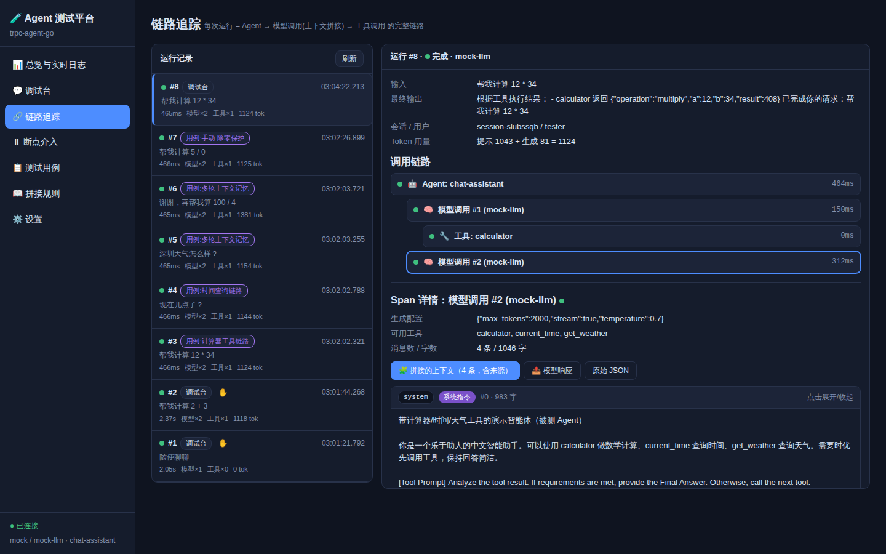
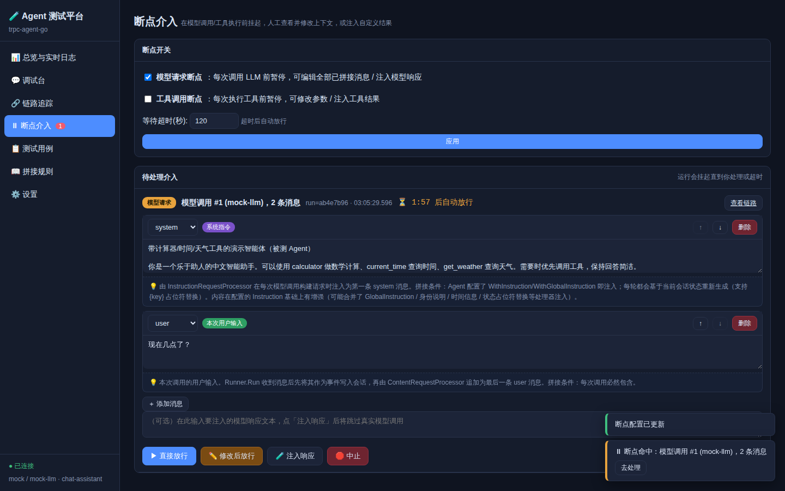

# trpc-agent-go Agent 测试监控平台

一个针对 [trpc-agent-go](https://github.com/trpc-group/trpc-agent-go) 的**标准 Agent 测试平台**：
用 Web 页面实时监控 Agent 的每一步执行，重点覆盖——

- 🧩 **上下文拼接监控**：每次模型调用前捕获最终拼接的全部消息，并对每条消息做**来源归因**
  （系统指令 / 会话历史 / 本次用户输入 / 本轮工具调用与结果 / 处理器注入 / 人工修改），
  同时解释"**哪些上下文在什么条件下拼接**"；
- 🔗 **调用链路追踪**：`Agent → 模型调用 #N → 工具调用` 的 span 树（耗时、状态、Token 用量、事件流）；
- ⏸ **人工介入（断点）**：在模型调用 / 工具执行前挂起，页面上**编辑上下文消息**（增删改、调整顺序）、
  **修改工具参数**，或直接**注入自定义响应/结果**跳过真实调用；
- 📋 **测试用例管理**：手动录入 / JSON 导入导出 / 模板或 LLM 自动生成，批量运行并校验断言
  （输出包含 / 正则 / 工具是否被调用 / 耗时上限 / 模型调用次数上限 / 无错误）；
- 📜 **每一步打印日志**：Agent 开始/结束、上下文拼接明细（逐条消息来源）、模型调用、工具执行、
  事件流、断点介入、用例断言……全部输出到终端 stdout，同时通过 SSE 推送到页面实时滚动展示。

| 链路追踪 + 上下文来源归因 | 断点介入编辑器 |
| --- | --- |
|  |  |

## 快速开始（部署）

要求：Go ≥ 1.24（仓库根目录的框架代码随本平台一起以 `replace ../` 方式引用，无需发布版本）。

```bash
git clone https://github.com/trpc-group/trpc-agent-go.git
cd trpc-agent-go/testplatform

# 方式一：离线模式（无需任何 API Key，内置确定性 Mock 模型，支持完整工具调用链路）
go run .

# 方式二：接入真实模型（任意 OpenAI 兼容 API）
export OPENAI_API_KEY="你的Key"
export OPENAI_BASE_URL="https://api.deepseek.com/v1"   # 可选，兼容接口地址
export MODEL_NAME="deepseek-v4-flash"                  # 可选，默认 deepseek-v4-flash
go run .
```

启动后打开 **http://localhost:8080/** 即可。常用参数：

```bash
go run . -addr :8080 -data ./testplatform-data -max-runs 300
#         监听地址     测试用例持久化目录          内存中保留的链路数
```

模型/Agent 配置（provider、模型名、Base URL、API Key、流式、温度、系统指令）也可以在
页面的「⚙️ 设置」里**运行时热切换**，保存后自动重建被测 Agent。

### Docker 部署

```bash
# 在仓库根目录执行（构建上下文需要包含框架源码）
docker build -f testplatform/Dockerfile -t trpc-agent-testplatform .
docker run -p 8080:8080 -v $(pwd)/tp-data:/data trpc-agent-testplatform
# 接真实模型：
docker run -p 8080:8080 -e OPENAI_API_KEY=xxx -e MODEL_NAME=deepseek-v4-flash trpc-agent-testplatform
```

## 功能页面

| 页面 | 功能 |
| --- | --- |
| 📊 总览与实时日志 | 运行统计卡片；全量步骤日志实时滚动（可按级别/类别过滤，点击 run id 跳转链路） |
| 💬 调试台 | 多会话对话调试被测 Agent，流式输出，一键开关断点，查看会话事件 |
| 🔗 链路追踪 | 运行列表 + span 树；点开模型调用 span 查看**拼接的上下文（含来源徽章与拼接原因）**、模型响应、原始 JSON；工具 span 查看参数/结果（含人工修改前后对比） |
| ⏸ 断点介入 | 模型/工具断点开关与超时；待处理介入队列：编辑消息（带来源与原因提示）→ 直接放行 / 修改后放行 / 注入响应 / 中止 |
| 📋 测试用例 | 用例表格（新建/编辑/删除/导入/导出/生成）；批量运行；结果含逐条断言明细并链接到链路 |
| 📖 拼接规则 | trpc-agent-go 请求处理器流水线的静态说明：每个处理器**在什么条件下**拼接什么内容 |
| ⚙️ 设置 | 运行时切换模型 provider / 模型名 / Base URL / Key / 流式 / 温度 / 系统指令 |

## 上下文拼接：捕获点与归因原理

平台通过 `llmagent.WithModelCallbacks` 注册 **BeforeModel** 回调，在框架的请求处理器流水线
（Basic → Planning → Instruction → Identity → Skills → Time → **Content** → …）执行完、请求发往模型前，
拿到最终的 `model.Request.Messages`，然后结合 `agent.InvocationFromContext(ctx)` 中的会话事件做归因：

| 来源标签 | 判定与拼接条件 |
| --- | --- |
| 系统指令 | 第一条 `system` 消息；由 InstructionRequestProcessor 每轮重新生成（含 `{state_key}` 占位符替换、身份/时间等合并） |
| 会话历史 | 与会话中此前事件逐条匹配（角色+内容/工具签名）；ContentRequestProcessor 在 `IncludeContents != none` 时按时间序回放 |
| 本次用户输入 | 与本次 `Runner.Run` 的输入相同的最后一条 `user` 消息 |
| 模型工具调用(本轮) / 工具执行结果 | 匹配到**当前 invocation** 的事件；仅当上一次模型响应包含 `tool_calls` 时出现 |
| 处理器注入 | 未匹配到任何会话事件（knowledge/summary/planner 等能力开启时注入） |
| 人工修改 | 断点介入时被编辑/新增的消息（原始消息保留在 span 的 `original_messages` 中） |

人工介入同样发生在 BeforeModel 回调里：断点开启时回调阻塞等待页面操作——
"修改后放行"直接改写 `Request.Messages`；"注入响应"返回 `CustomResponse` 跳过真实模型调用；
工具断点则通过 `BeforeTool` 回调的 `ModifiedArguments` / `CustomResult` 实现。
一切都基于框架公开的回调 API，**不修改框架源码**。

## 测试用例格式（导入/导出 JSON）

```json
[
  {
    "name": "计算器工具链路",
    "description": "验证模型会调用 calculator 并给出正确结果",
    "turns": ["帮我计算 12 * 34"],
    "assertions": [
      { "type": "tool_called", "value": "calculator" },
      { "type": "contains", "value": "408" },
      { "type": "no_error" }
    ]
  }
]
```

断言类型：`contains` / `not_contains` / `regex` / `tool_called` / `tool_not_called` /
`no_error` / `max_latency_ms` / `max_model_calls`。
每个用例在**全新会话**中按 `turns` 顺序执行（多轮用例可验证会话历史拼接），
所有轮次共享一次断言评估；每轮都会生成独立的链路记录并在结果中可跳转。

用例生成：`template` 模式离线可用（围绕内置工具生成）；`llm` 模式用当前配置的模型生成
（输出不合法时自动回退模板）。

## 被测 Agent 与 Mock 模型

默认被测 Agent（`chat-assistant`）挂载三个演示工具：`calculator`（四则/幂运算）、
`current_time`（时区时间）、`get_weather`（确定性模拟天气）。
未配置 API Key 时使用内置 **Mock 模型**：能识别算式/时间/天气问题并发起真实的工具调用循环
（含流式分片输出），因此**所有平台能力离线即可完整演练**；配置 Key 后即为真实 LLM 测试。

要测试你自己的 Agent，修改 `internal/platform/platform.go` 中 `rebuildLocked` 的
`llmagent.New(...)` 组装逻辑（替换工具/指令/模型），或按同样方式把
`Collector` 的三组回调挂到你现有的 Agent 上即可。

## HTTP API 一览

```text
GET  /api/status                 平台状态          GET  /api/stream               SSE 实时流
GET  /api/logs                   步骤日志          GET  /api/context-rules         拼接规则
GET  /api/runs / /api/runs/{id}  链路列表/详情     POST /api/runs/{id}/cancel      取消运行
POST /api/chat                   调试台发消息      GET  /api/sessions[/{id}]       会话/事件
GET|POST /api/breakpoints        断点开关          GET  /api/interventions         待介入列表
POST /api/interventions/{id}     处理介入(continue/modify/mock/abort)
GET|POST /api/testcases          用例列表/新建     PUT|DELETE /api/testcases/{id}  编辑/删除
POST /api/testcases/import       导入              GET  /api/testcases/export      导出
POST /api/testcases/generate     生成(template/llm)
POST /api/testruns               批量运行          GET  /api/testruns[/{id}]       结果
GET|POST /api/settings           模型/Agent 配置
```

## 目录结构

```text
testplatform/
├── main.go                     # 入口：flags、HTTP 服务
├── internal/platform/
│   ├── platform.go             # 平台装配、被测 Agent/Runner 构建、设置热更新
│   ├── collector.go            # 埋点核心：Agent/Model/Tool 回调 → 链路 + 日志 + 断点
│   ├── provenance.go           # 上下文来源归因 + 拼接规则说明
│   ├── breakpoint.go           # 断点/介入管理（挂起、放行、修改、注入、超时）
│   ├── chat.go                 # 运行执行器（事件流消费）
│   ├── trace.go                # 链路数据模型与存储
│   ├── testcase.go / testrun.go# 用例存储/生成/导入导出 + 批量执行与断言
│   ├── mockmodel.go / tools.go # 内置 Mock 模型与演示工具
│   ├── logger.go / hub.go      # 步骤日志（stdout+环形缓冲）与 SSE 广播
│   └── api.go                  # REST + SSE 接口
└── web/                        # go:embed 的单页 UI（原生 JS，无构建步骤）
```
