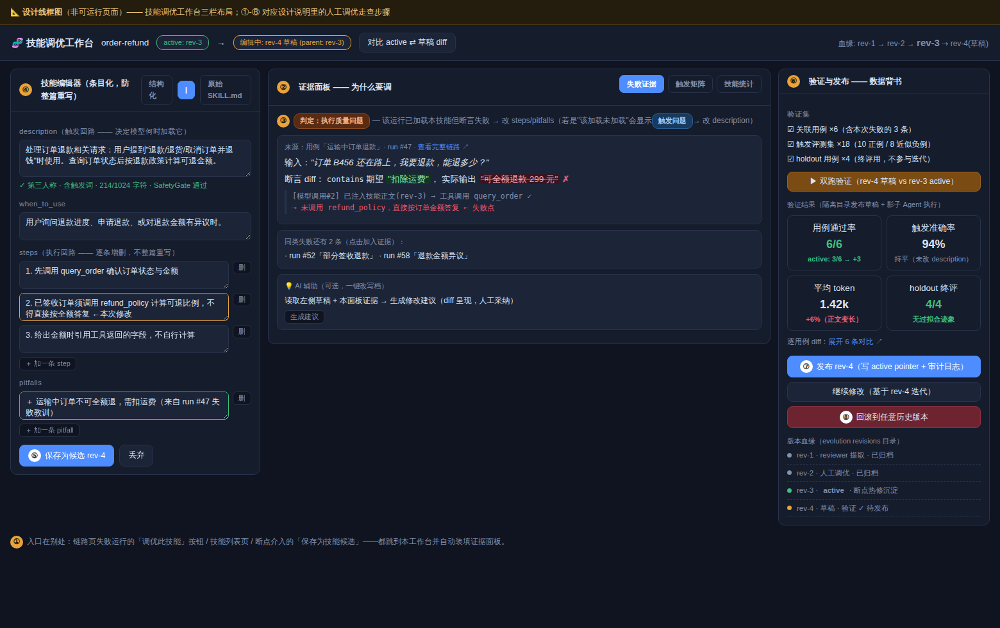

# Skill 调优专题：调研与实现方案（补充报告）

<!-- AGENT-GUIDE-START -->
> **FOR AI AGENTS（机器可读导读）**
>
> - **本文档用途**：`testplatform/` 增加「Skill 调优」能力的调研与实现方案。实现某个 skill 相关功能前：§2 查框架 API（含代码路径与接口签名），§3 查外部成功案例的设计依据，§4 查落地方案（S0-S3 分期、数据模型、API 草案；**§4.7 人工调优工作台交互详案**，配套线框图 `skill-workbench-wireframe.html`）。
> - **前置文档**：`observability-research.md`（同目录）——观测/评测基础设施的调研，本文的 S1/S2 依赖其中 P0/P1 条目（实验对比视图、score 实体化、LLM-as-judge）。
> - **关键结论速查**：框架已内置完整的 skill 调优后端（`evolution/` 包：LLM 复盘提取 → 门禁 → 审批 → 版本化发布/回滚）；平台要做的是**编排与界面**——把测试用例集当适应度函数（Outcome 信号源）、把审批做成收件箱 UI、把自动调优做成"生成候选→门禁→回归评分→帕累托保留"的循环。**不要重造 evolution 已有的任何环节。**
> - **落地位置速查**：技能仓库 → `skill/repository.go`；进化流水线 → `evolution/`（types/service/gates/approval_service/revision/publisher）；技能加载工具 → `tool/skill/`（skill_load / skill_run）；Runner 自动入队 → `runner.WithEvolutionService`；平台侧新增代码建议放 `testplatform/internal/platform/skilltune.go` + `api.go` 扩展。
<!-- AGENT-GUIDE-END -->

本报告回答三个问题：**"调优 skill"到底在调什么**（§1）、**框架已经给了什么底座**（§2，代码级）、**成功案例是怎么设计的**（§3，外部调研）、以及**平台怎么实现**（§4，分期方案）。

## 1. 问题定义：调优 skill 在调什么

### 1.1 Skill 在 trpc-agent-go 中的形态

Skill = 一个包含 `SKILL.md` 的目录（YAML front matter：`name`/`description` + Markdown 正文 + 可选附属文档/脚本），由 `skill.Repository` 接口管理（`Summaries()` 列摘要 / `Get(name)` 取全文 / `Path(name)` 取目录；`FSRepository` 支持多根扫描与 `Refresh()` 热重载）。运行期由两个内建工具消费：

- **`skill_load`**（`tool/skill/load.go`）：Agent 按需把某个技能的正文装进上下文（渐进披露——平时上下文里只有技能名+描述的清单）；已加载技能记录在会话状态（`skill:loaded:*` 状态键），因此**可以从会话/事件流里精确判定"这次运行加载了哪些技能"**；
- **`skill_run`**（`tool/skill/run.go`）：在受控环境里执行技能附带的脚本/命令（有 allow/deny 命令配置）。

`llmagent` 有约 20 个 skill 相关 Option（`WithSkills`、`WithSkillScopeMode` 多租户隔离、`WithMaxLoadedSkills`、`WithToolActivationOnSkillLoad` 加载技能时激活对应工具集等）。

### 1.2 可调优的四个对象与调优信号

| 调优对象 | 影响什么 | 典型病症 |
| --- | --- | --- |
| **description / when_to_use** | 技能**被选中**的概率（模型只看清单决定 load 什么） | 该加载不加载（漏召回）、不该加载乱加载（误触发、浪费上下文） |
| **正文 steps / pitfalls** | 加载后的**执行质量** | 步骤含糊导致工具用错、缺少陷阱提示反复踩坑 |
| **附属脚本/文档** | `skill_run` 的执行正确性 | 脚本过时、路径写死 |
| **技能集组织** | 清单长度与互相竞争 | 技能太多太相似，选择困难+上下文膨胀 |

对应的**调优信号**（平台已有或易得）：用例通过率（断言体系）、技能命中矩阵（应加载 vs 实际加载，from 会话状态+skill_load 工具调用）、加载后成功率（加载了该技能的运行 vs 未加载的通过率差）、token/耗时成本、失败轨迹（trace 全量留存）。

## 2. 框架自带的调优底座：`evolution/` 模块代码级解读

这是本次调研最重要的发现：**trpc-agent-go 已经内置了一条完整的技能进化流水线**（README 称 "Hermes-style 会话复盘"），缺的只是编排入口和界面——正好是测试平台的位置。

### 2.1 流水线架构

```
运行结束 ──入队──▶ ReviewPolicy(值得复盘吗，默认≥4次工具调用)
                     │
                     ▼
              LLMReviewer(读压缩 transcript ± Outcome，产出 SkillSpec JSON)
                     │  SkillSpec{name, description, when_to_use, steps[], pitfalls[]}
                     ▼
              Reconciler(确定性去重/吸收/合并，4 条字符串规则)
                     │
                     ▼
     Gates: SpecGate(schema/命名/查重) → SafetyGate(密钥/危险命令/路径穿越)
            → EffectivenessGate(按 Outcome: fail/agent_error 拒绝, score<80 转 pending_eval)
            → HumanGate(可选: AlwaysHold / CreateOnlyHold → pending_approval)
                     │
                     ▼
              Publisher(写 SKILL.md 到 managed skills 目录) ──▶ 下次运行 skill_load 可见
```

### 2.2 关键接口与对接点（含代码路径）

- **入队**：`evolution.Service.EnqueueLearningJob(ctx, LearningJob{Session, Outcome, Scope})`（`evolution/types.go`）。`Outcome{Status: success|partial|fail|agent_error, Score *float64(0-100), Notes}` 是**评测器对接点**——官方文档示例的 Notes 就写着 `"all assertions passed"`，即设计意图就是让基准/测试运行器来填。不带 Outcome 时 Reviewer 退化为"仅凭 transcript 复盘"；带 Outcome 时切换为**失败感知学习**（从失败里提炼 pitfalls，且绝不虚构 Agent 没执行过的步骤）。
- **Runner 集成**：`runner.WithEvolutionService(svc)` 让 Runner 在每次运行后自动入队（仅 Session，无 Outcome）——适合线上；**测试平台应该自己入队并带上 Outcome**（断言结果→Status，通过率→Score）。
- **版本与血缘**：每次变更是不可变 `Revision{SkillID, RevisionID, ParentID, Source, Action: create|update|delete, Spec, Status}`（`evolution/revision.go`）。磁盘结构：`revisions/<skill-id>/revisions/<rev-id>/meta.json` + `active.txt`（当前生效指针）+ `audit.log`（append-only 审计）。状态机：`pending → rejected | pending_eval | pending_approval | active → archived`。
- **审批与回滚**：`ApprovalService.ListPending(opts)` / `Decide(ApprovalDecision)` / `Rollback(skillID, opts)`（`evolution/approval_service.go`），带按 skill 的决策锁、审批超时自动过期（`WithApprovalTimeout`）、门禁 shadow 模式（`WithApprovalGateShadow`：只记指标不拦截，用于灰度上新门禁）。
- **指标**：`ApprovalGateMetricsProvider` 暴露门禁命中统计。
- **装配**（`examples/evolution/main.go` 全套）：`evolution.NewService(reviewModel, WithManagedSkillsDir(...), WithSkillRepository(repo), WithReviewPolicy(...), WithCandidateStore(NewFileCandidateStore(dir)), WithActivePointer(NewFileActivePointer(dir)), WithSpecGate/WithSafetyGate/WithEffectivenessGate(...))`。

### 2.3 现状缺口（= 平台的机会）

1. **无界面**：pending_approval 只能靠代码/文件查看，审批收件箱、revision diff、审计日志都没有 UI；
2. **Outcome 无来源**：线上自动入队不带 Outcome，EffectivenessGate 形同虚设——需要一个持续产 Outcome 的评测器（正是测试平台的用例回归）；
3. **单样本学习**：一次入队只看一个 session；没有"跨多次失败运行找共性→定向改技能"的批量反思；
4. **没有调优循环**：evolution 是"单向流水线"（提取→发布），没有"生成多个候选→逐一评测→择优"的搜索过程（§3 的 GEPA/MIPRO 类算法正是补这块）；
5. **技能命中可观测性缺失**：哪个技能被加载了、加载后有没有用、误触发率——框架不统计（但数据都在会话状态与事件里）。

## 3. 成功案例设计剖析

> 四组外部调研：技能规范与人工迭代方法论（3.1）、程序化自动优化算法（3.2）、从轨迹中沉淀技能的学术系（3.3）、把调优做成产品功能的商业系（3.4）。各小节末尾附来源；调研代理仅陈述其打开页面支持的事实，存疑处已标「未核实」。

### 3.1 Anthropic Agent Skills：规范与官方迭代方法论

**为什么先看它**：SKILL.md 就是 Anthropic 定义的开放标准（trpc-agent-go 的 skill 体系即此形态），而官方的 skill-creator 是"用 skill 调优 skill"的第一手成功案例。

调研日期：2026-07-08。已打开来源：platform.claude.com 的 Skills 概览与 best-practices、code.claude.com 的 skills 文档、anthropics/skills 仓库（README、spec、目录树）、skill-creator / pptx / mcp-builder / webapp-testing 的 SKILL.md 原文。anthropic.com 工程博客在本环境被代理拦截（403），其论点经官方文档与搜索摘要交叉印证。

#### 规范与结构

Skill = 一个包含 `SKILL.md` 的文件夹（"folders of instructions, scripts, and resources that agents can discover and load dynamically"）。规范（Agent Skills Spec，v1.0 2025-10-16 发布，v1.1 2025-12-16，现托管于 agentskills.io）规定 frontmatter：

- **必填**：`name`（hyphen-case，小写字母数字+连字符，**必须与目录名一致**）、`description`（做什么 + 何时用）。
- **可选**：`license`（建议只写许可证名或捆绑文件名，如 pptx 的 `license: Proprietary. LICENSE.txt has complete terms`）、`allowed-tools`（预批准工具列表，"Currently only supported in Claude Code"）、`metadata`（string→string map，留给客户端扩展）。
- **Anthropic API 层面约束**：name ≤64 字符、不得含 XML 标签、不得含保留词 "anthropic"/"claude"；description 非空、≤1024 字符。
- **Claude Code 扩展字段**（超出开放标准）：`when_to_use`、`argument-hint`、`arguments`、`disable-model-invocation`、`user-invocable`、`disallowed-tools`、`model`、`effort`、`context: fork`、`agent`、`hooks`、`paths` 等，另有 `$ARGUMENTS` 替换与 `` !`cmd` `` 动态上下文注入（命令输出在模型看到前先内联）。

目录约定（skill-creator 原文）：`scripts/`（确定性/重复任务的可执行代码）、`references/`（按需读入上下文的文档）、`assets/`（用于产出的模板/图标/字体）。写法要求：命名避免 `helper`/`utils` 这类含糊词，官方建议动名词或名词短语（`processing-pdfs`）；description **必须第三人称**、含具体触发词；SKILL.md 正文 <500 行，引用文件只允许一层深（嵌套引用会导致模型 `head -100` 式的不完整阅读），长参考文件顶部加目录。

#### 渐进披露设计

三层加载（官方表格）：

| 层级 | 加载时机 | Token 成本 |
|---|---|---|
| L1 元数据（name+description） | 启动时常驻 system prompt | ~100 tokens/skill |
| L2 SKILL.md 正文 | 触发时经 bash 读入 | <5k tokens |
| L3+ 附属文件/脚本 | 按需读取/执行 | "effectively unlimited" |

设计动机是上下文经济学："The context window is a public good"。元数据常驻使得可安装大量 skill 而无上下文惩罚；脚本经 bash 执行时**代码本身永不进入上下文，只有输出计费**，因此可捆绑无上限的参考资料（"No practical limit on bundled content"）。客户端集成规范定义了两种实现：filesystem-based（模型用 `cat /path/to/SKILL.md` 触发）与 tool-based；系统提示中以 `<available_skills>` 列表注入 name/description/location 三字段。Claude Code 还有工程细节：skill 载入后驻留整个会话；compaction 时每个已调用 skill 保留前 5,000 tokens、合计预算 25,000；描述列表预算默认为上下文窗口的 1%，单条 description+when_to_use 截断于 1,536 字符。

#### skill-creator 与官方迭代方法论

skill-creator 是官方"用 skill 造 skill"的元技能，自带 `agents/`（grader.md、comparator.md、analyzer.md）、`eval-viewer/`、`scripts/`（aggregate_benchmark、package_skill、run_loop）、`references/schemas.md`。其核心循环（SKILL.md 原文）："draft → test → evaluate → improve → repeat"：

1. **捕获意图**：明确技能做什么、何时触发、输出格式、是否需要测试用例（可客观验证的适合，主观输出不必强加）。
2. **写草稿**：description 是 "the primary triggering mechanism"，且因 Claude 目前倾向 **undertrigger**，官方明确建议把描述写得 "pushy"（罗列触发场景）。
3. **跑测试**：2-3 条真实 prompt，**同一轮并行 spawn with-skill 与 baseline（无 skill 或旧版）子代理**，隔离上下文运行；边跑边写量化断言。
4. **评估**：grader 按断言产出 `grading.json`（text/passed/evidence）；`aggregate_benchmark` 汇总 pass_rate/时间/tokens 的 mean±stddev 与 delta 到 `benchmark.json`；**必须先生成 eval-viewer 让人审阅**（原文全大写强调 "GENERATE THE EVAL VIEWER *BEFORE* evaluating inputs yourself"），人的反馈写入 `feedback.json`。
5. **改进**：四条原则——从反馈**泛化**（拒绝过拟合的 fiddly 修改，"skills that can be used a million times"）；**保持精简**（读 transcript，删掉让模型做无用功的部分）；**解释为什么**（满屏大写 MUST/ALWAYS 是 yellow flag）；**发现重复劳动**（若三个测试用例都各自写了类似脚本，就沉淀进 `scripts/`）。
6. 按 `iteration-N/` 目录重跑直到满意，最后 `package_skill.py` 打包为 `.skill` 文件。

#### 评测与调优实践

- **Eval 先行**：best-practices 明文 "Create evaluations BEFORE writing extensive documentation"——先无 skill 跑代表性任务、记录具体失败，再建三个场景、测基线、写最小指令、迭代。eval 结构为 `{skills, query, files, expected_behavior[]}`（平台层 "not currently a built-in way to run these"，但 Claude Code 的 skill-creator 插件已把这套自动化）。
- **两个指标分开测**（code.claude.com）："whether Claude invokes it on the prompts it should, and whether the output matches what you expect when it does"，都要与禁用 skill 的 fresh session 做基线对比。
- **描述触发优化**：生成 20 条 trigger evals（8-10 正例覆盖不同措辞，8-10 负例要"near-misses"而非明显无关）；`run_loop.py` 按 60/40 切 train/test，每条 query 跑 3 次取触发率，Claude 依失败案例提议新描述，最多 5 轮，**按 held-out test 分选 best_description 防过拟合**。还提供 blind A/B：独立 judge 不知版本身份地比较两版输出。
- **其他**：用 Claude A（作者）/Claude B（使用者）双实例迭代；观察模型导航行为（意外阅读顺序、从不读的文件=信号不足或冗余）；用计划使用的所有模型（Haiku/Sonnet/Opus）都测过。

#### 成熟 skill 的设计特征（含例子）

生态：**Claude Code** 从 `~/.claude/skills/`、项目 `.claude/skills/`、插件、企业托管目录加载（文件系统式，支持嵌套/热更新/`/skill-name` 调用）；**API** 经 code execution 容器 + beta 头（`skills-2025-10-02`、`files-api-2025-04-14`），`/v1/skills` 上传、workspace 共享、无网络；**claude.ai** 在 Settings>Features 上传 zip，按用户隔离。三处互不同步。仓库现有 17 个技能（docx/pdf/pptx/xlsx 为 source-available 的生产级文档技能，其余 Apache 2.0）。共同特征：

- **pptx**：极长且 pushy 的 description（穷举触发场景，"Trigger whenever the user mentions 'deck,' 'slides,' 'presentation'…"）；SKILL.md 只做 Quick Reference 表 + 工作流分流，细节推给 `editing.md`/`pptxgenjs.md`；捆绑 `thumbnail.py`、`unpack.py` 等脚本。
- **webapp-testing**：决策树式流程；脚本按黑盒使用——"DO NOT read the source until you try running the script first…These scripts can be very large and thus pollute your context window"。
- **mcp-builder**：分阶段工作流（研究→实现→评估），教模型去外部 sitemap 拉 `.md` 文档而非内置全文——把"知识"变成"取知识的方法"。

#### 对「在 Go Agent 测试平台里做 skill 调优」的启示

1. **触发与执行拆成两个独立指标**：trigger accuracy 用 should/should-not-trigger 查询集（负例必须是近似干扰项），每条 query 采样 ≥3 次算触发率；执行质量用断言 pass rate。两者分别归因，改 description 与改 body 是两条不同的调优回路。
2. **一切迭代都带并行基线**：with-skill 与 no-skill/old-skill 同批同环境运行，报告 pass_rate、tokens、耗时的 mean±stddev 与 delta——skill 的价值 = 通过率提升相对 token/时间开销的净收益，这应是平台的默认报表。
3. **防过拟合机制内建**：查询集 train/test 切分（官方用 60/40），按 held-out 分数选版本；迭代产物按 `iteration-N/` 归档，保留上一轮输出与人评供对照。
4. **每个 eval case 用全新隔离会话**（Go 里即独立 Runner/Session/上下文），杜绝作者会话残留掩盖指令缺陷；同时记录 transcript 作为一等产物——失败分析靠读轨迹（无效动作、重复写同类脚本→沉淀为 skill 附带脚本/工具）。
5. **实现渐进披露的加载器**：常驻仅注入 name+description（+路径），正文与附属文件按需读取；给描述列表设字符预算并监控截断——这是 Go 框架侧支持 SKILL.md 标准的最小正确实现（参照 spec 的 filesystem-based / tool-based 两种客户端模式）。
6. **LLM 评分 + 人评双轨**：断言尽量脚本化验证（可复用、可重跑），LLM grader 输出 passed+evidence；版本比较用盲测 A/B judge；但先把渲染好的输出摆到人面前（HTML viewer 模式），人的定性反馈驱动下一轮泛化式修改而非补丁式约束。

#### Sources

- [Agent Skills overview — Claude Platform Docs](https://platform.claude.com/docs/en/agents-and-tools/agent-skills/overview)
- [Skill authoring best practices — Claude Platform Docs](https://platform.claude.com/docs/en/agents-and-tools/agent-skills/best-practices)
- [Extend Claude with skills — Claude Code Docs](https://code.claude.com/docs/en/skills)
- [anthropics/skills 仓库 README 与目录](https://github.com/anthropics/skills)
- [Agent Skills Spec：skill-authoring.md / skill-client-integration.md（仓库内快照 @be229a5；正式版在 agentskills.io/specification，本环境未能直接打开）](https://github.com/anthropics/skills/tree/main/spec)
- [skill-creator SKILL.md 原文](https://github.com/anthropics/skills/tree/main/skills/skill-creator)
- [pptx](https://github.com/anthropics/skills/tree/main/skills/pptx) / [mcp-builder](https://github.com/anthropics/skills/tree/main/skills/mcp-builder) / [webapp-testing](https://github.com/anthropics/skills/tree/main/skills/webapp-testing) SKILL.md 原文
- [Equipping agents for the real world with Agent Skills — Anthropic Engineering（未能直接打开，403；观点经上述文档及搜索摘要印证，涉及其独有表述处未直接引用）](https://www.anthropic.com/engineering/equipping-agents-for-the-real-world-with-agent-skills)

### 3.2 程序化优化算法：DSPy、GEPA 与文本梯度

**为什么看它**：这是"自动调优"的算法学——数据集+评分函数+变体生成+搜索策略四要素的各种组合，其中反思式（GEPA）以 35 倍更少的评估次数反超强化学习，是 S3 自动调优循环的直接理论依据。

#### DSPy 优化器家族

DSPy 把「提示调优」形式化为编译问题：任何优化器都吃三样输入——**你的 DSPy 程序**（单模块或多模块流水线）、**一个 metric 函数**（对输出打分，越高越好）、**训练输入**（官方文档明言可以"非常小，只有 5 或 10 条，且可以不完整——只有输入没有标签"）。metric 的标准签名是 `def metric(example, pred, trace=None) -> float/bool`；关键设计是 `trace` 参数：评估时 `trace is None` 返回连续分数，而在自举示例（bootstrapping）阶段 `trace is not None`，此时应返回严格布尔值来判定该条轨迹是否够格当示例。metric 本身可以是"一个更小的 DSPy 程序"，即用 LLM 做 AI 反馈评审。

- **BootstrapFewShot**：用一个 teacher 模块（默认就是程序自身）在训练集上跑，凡是 metric 判为通过的完整执行轨迹，就被收割为程序**每一级模块**的 few-shot 演示——"自举"指示例不是人写的，而是模型自己跑对后留下的。官方建议约 10 条数据时从它入手。
- **BootstrapFewShotWithRandomSearch**：多次运行 bootstrap 并对生成的示例组合做随机搜索、择优。建议 50+ 条数据。
- **MIPROv2**：同时优化**指令文本和 few-shot 示例**，三阶段：(1) *bootstrap*——从训练集随机采样跑程序，输出正确的留作候选示例；(2) *grounded proposal*——让 LLM 结合"数据集特性摘要 + 程序代码摘要 + 已自举示例 + 随机提示技巧"生成多样的候选指令；(3) *离散搜索*——用贝叶斯优化跑 `num_trials` 轮，每轮在 minibatch 上评估一组「指令×示例」组合，周期性上全量验证集。参数含 `metric`、`auto`（light/medium/heavy 档位）、`num_candidates`、`max_bootstrapped_demos` 等；官方建议 200+ 条数据、40 trials 以上的长跑。
- **dspy.GEPA**：见下节；在 DSPy 里它要求带反馈的 metric（返回 `dspy.Prediction(score=..., feedback=...)`，签名含 `gold, pred, trace, pred_name, pred_trace`），还可当推理时搜索器用（`valset` 设为评估批 + `track_best_outputs=True`）。
- 另有 **BootstrapFinetune**（把提示程序蒸馏成权重更新）、**Ensemble/BetterTogether**（组合程序、串联提示优化与权重优化）。

文档给出的典型效果：ReAct 代理 24%→51%，RAG 53%→61%，GPT-4o-mini 分类 66%→87%。

#### GEPA：反思式进化

GEPA（Genetic-Pareto，Agrawal 等 2025，arXiv:2507.19457，检索显示已被 ICLR 2026 接收为 Oral）的核心主张：不要把执行反馈压缩成一个标量奖励，而是**让 LLM 通读完整执行轨迹**——错误消息、推理日志、失败的解析、约束违规——诊断"为什么失败"，再据此改写提示。官方库把这种诊断性文本叫 ASI（Actionable Side Information），称其为"文本优化里的梯度类似物"。

优化循环五步：从 **Pareto 前沿**选一个候选 → 在 minibatch 上执行并抓全量轨迹 → LLM **反思**诊断失败 → **变异**出改进版 → 若有提升则**接纳**入池并更新前沿；另支持 system-aware **merge**（合并两个在不同用例子集上各有所长的 Pareto 最优候选，相当于杂交）。Pareto 前沿的定义是"在至少一个评估实例上取得最高分的候选集合"——保留局部冠军而非只留全局最优，用以维持多样性、防早收敛。

输入极轻：`gepa.optimize(seed_candidate, trainset, valset, task_lm, reflection_lm, max_metric_calls)`，README 称训练集"少至 3 条"即可，metric 返回分数并可附反馈文本；执行模型与反思模型分开配置。

效果数字：论文摘要（经 arXiv 检索摘要转述，论文页本身未能直接打开）称 GEPA 在 HotpotQA（多跳问答）、IFBench（指令遵循）、HoVer（检索验证）、PUPA（隐私感知委托）四任务、Qwen3 8B 与 GPT-4.1 mini 两模型上，**比 GRPO 平均高 10%、最高约 19-20%，rollouts 最多少 35 倍**；并在所有基准和模型上超过 MIPROv2，汇总优化增益 +14%（另一检索摘要称约为 MIPROv2 +7% 的两倍，精确表述未核实）。官方库 README 给的量级是"100–500 次评估 vs GRPO 的 5,000–25,000+"，并列举案例：AIME 2025 上 GPT-4.1 mini 46.6%→56.6%、ARC-AGI 代理 32%→89%、Jinja 编码代理解决率 55%→82%、Databricks 称"开源模型+GEPA 以约 1/90 成本打平/超过 Claude Opus 4.1"（均为项目方自述）。

#### 其他优化器速览

- **Microsoft PromptWizard**（arXiv:2405.18369）：自进化离散优化——LLM 对自己的提示做"变异→评分→批评→综合"迭代，且**指令与上下文示例顺序联合优化**（含合成反例、CoT 与专家人设注入）；实验用约 25 条（建议 20–50 条）训练样例，主打低 API 调用成本。
- **TextGrad**（Stanford Zou 组，成果 2025 年 3 月发表于 Nature 639:609–616）："文本自动微分"——用 LLM 生成自然语言批评作为"文本梯度"，沿计算图反向传播；API 仿 PyTorch（`tg.Variable`/`TextLoss`/`TGD`），可优化提示、代码、答案乃至分子结构。
- **OpenAI Prompt Optimizer**：Playground/Logs 页内建的免费聊天式工具，按最佳实践**一次性重写**提示——修掉指令自相矛盾、缺失/含混的格式规定、提示与 few-shot 示例不一致等，可一键应用；本质是 meta-prompt 改写，不做数据驱动搜索。
- **Anthropic Prompt Improver**（Claude Console）：输入提示模板 +（可选）问题反馈 + 示例输入/理想输出，四步走：定位示例→重构为带 XML 标签的结构化草稿→加入并打磨 CoT 推理指令→升级示例以演示新推理过程，并加策略性 prefill；官方定位于"高准确率优先于时延"的复杂任务，且与 Console 的评估工具、测试用例生成器配套成"生成→改进→评测"闭环。

#### 四要素与共同规律

所有成功系统都由同四件套构成：**① 数据集**（DSPy 可 5–10 条起步、GEPA 称 3 条起、PromptWizard 20–50 条、MIPROv2 长跑要 200+，且都强调留 holdout 验证集防过拟合）；**② 可计算评分函数**（从布尔断言到连续分到 LLM 评审，GEPA 进一步升级为"分数+反馈文本"）；**③ 变体生成器**（自举示例、grounded 指令提议、反思式变异、批评-综合、文本梯度、meta-prompt 重写）；**④ 搜索策略**（随机搜索、贝叶斯优化、遗传+Pareto、贪心迭代、单发改写）。

反思式为何强于盲搜：仅凭分数的搜索每次 rollout 只回收 1 比特信息，变异只能靠碰运气；反思式把轨迹与失败原因喂给提议器，每次 rollout 回收的是**稠密、可操作的诊断**，因此修改有的放矢——这正是 GEPA 用 35 倍更少 rollouts 反超 RL 的机制来源。Pareto 前沿则解决"只留全局最优会丢掉在难例上独赢的候选"的多样性坍缩问题。

#### 对「测试平台内建 skill 自动调优」的启示

1. **测试用例天然是 trainset/valset**：把平台既有用例切成"优化集 + 保留集"，按 DSPy/GEPA 的经验 5–20 条即可启动（BootstrapFewShot/GEPA 档），用例多于 200 条再上 MIPROv2 式贝叶斯长跑；保留集只用于最终回归，防止 skill 过拟合到少数用例。
2. **断言即 metric，但要输出"分数+反馈"**：pass/fail 断言直接就是 `metric(example, pred) -> bool`；参照 GEPA 的 `ScoreWithFeedback`，把断言失败的期望值/实际值差异、错误消息、工具调用轨迹摘要一并作为 feedback 文本返回——这是反思式调优的燃料。学 DSPy 的 `trace` 约定：筛示例时用严格布尔，评估排序时用连续分（如通过断言比例）。
3. **变体生成用反思式变异，不用盲改写**：让强模型通读失败用例的完整执行轨迹 + 断言 diff，针对性改写 skill 指令（GEPA 反思变异），而非模板化随机改写；同时可自举 few-shot——把跑通全部断言的真实执行轨迹收割为 skill 内嵌示例（BootstrapFewShot 机制）。
4. **编排一个带预算的 Pareto 搜索循环**：维护候选 skill 池，按"每条用例上谁最好"维护 Pareto 前沿；每轮从前沿选一候选→minibatch 用例评估→反思→变异→择优入池；总预算用 `max_metric_calls`（如 100–500 次用例执行）封顶，并仿 MIPROv2 提供 light/medium/heavy 档位。
5. **双模型配置**：执行 skill 用生产/便宜模型（task_lm），反思与提议用最强模型（reflection_lm）——gepa 库的默认形态，保证"教练比选手强"。
6. **产物与落库流程**：优化产物 = 新 skill 文本 + 学到的示例 + 每候选的用例级得分矩阵；上线前在保留集回归，并像 Anthropic Console 那样给人审一个可视 diff、一键采纳，而非静默覆盖。

Sources（dspy.ai 与 arxiv.org 域名经代理直连 403，DSPy 内容改读其官方仓库同源原始文档；GEPA 论文数字来自 arXiv 检索摘要与官方库 README，已在文中标注）：

- [DSPy Optimizers 总览（stanfordnlp/dspy 官方文档源，对应 dspy.ai/learn/optimization/optimizers）](https://raw.githubusercontent.com/stanfordnlp/dspy/main/docs/docs/learn/optimization/optimizers.md)
- [DSPy MIPROv2 API 文档（同仓库）](https://raw.githubusercontent.com/stanfordnlp/dspy/main/docs/docs/api/optimizers/MIPROv2.md)
- [DSPy Metrics 文档（metric 签名与 trace 语义）](https://raw.githubusercontent.com/stanfordnlp/dspy/main/docs/docs/learn/evaluation/metrics.md)
- [dspy.GEPA Overview 与 GEPA_Advanced（反馈 metric 设计）](https://raw.githubusercontent.com/stanfordnlp/dspy/main/docs/docs/api/optimizers/GEPA/overview.md)
- [gepa-ai/gepa 开源库（算法循环、API、案例数字）](https://github.com/gepa-ai/gepa)
- [GEPA 论文 arXiv:2507.19457（页面 403，数字经检索摘要转述）](https://arxiv.org/abs/2507.19457)
- [microsoft/PromptWizard](https://github.com/microsoft/PromptWizard)
- [zou-group/textgrad（Nature 2025 论文信息）](https://github.com/zou-group/textgrad)
- [OpenAI Prompt Optimizer 文档（经检索摘要）](https://platform.openai.com/docs/guides/prompt-optimizer)
- [Anthropic Console prompt improver 官方文档（全文已打开）](https://platform.claude.com/docs/en/build-with-claude/prompt-engineering/prompt-improver)

### 3.3 轨迹学习系：Voyager、Reflexion、ExpeL、ACE、Memp

**为什么看它**：回答"skill 从哪来、库怎么维护"——从可执行技能库的开山之作到防上下文坍缩的最新方法，这些是 evolution 模块设计的学术源头，也是其改进方向。

> 说明：本环境 egress 策略屏蔽了 arxiv.org / 项目主页直连，本次一手材料为 5 个官方 GitHub 仓库的 README 与源码原文（经 raw.githubusercontent.com 打开 8 个文件），论文数字经多条搜索快照交叉核对；无法核实处已标注。

#### Voyager：可执行技能库

Wang et al., 2023（arXiv:2305.16291，Guanzhi Wang、Linxi "Jim" Fan、Anima Anandkumar 等，NVIDIA 相关团队）。首个 LLM 驱动的 Minecraft 具身终身学习智能体，三组件：**自动课程**（依据当前技能与世界状态提出"难度合适"的下一个探索任务）、**不断增长的可执行代码技能库**、**迭代提示机制**（把环境反馈、执行错误、自我验证结果回灌给 GPT-4 迭代修程序）。

技能库设计（源码 `voyager/agents/skill.py` 直接确认）：

- **技能 = 一段自验证通过的 Mineflayer JavaScript 异步函数 + LLM 生成的自然语言描述**（≤6 句，专用 prompt 生成）；
- 描述经 OpenAI Embeddings 存入 **Chroma 向量库**，代码、描述、向量库三目录持久化，`skills.json` 与向量库强一致性校验；
- 检索时以任务/上下文为查询做相似度检索 **top-5**，命中的技能代码与控制原语一起注入生成 prompt，作为可调用 API 支持**组合复用**；
- 同名技能重写时删除旧向量、代码文件按 **V2/V3 版本号**留档——朴素的技能版本化。

结果（官方 README 摘要）：独特物品 3.3 倍、行进距离 2.3 倍、关键科技树里程碑最快 15.3 倍于此前 SOTA；技能库可搬到**全新世界**从零解新任务，其他方法难以泛化。它是"技能库"开山之作，因为它第一次把技能落成**经环境执行验证的代码工件 + 语义索引**，并给出完整闭环：课程出题 → 写码 → 执行报错/反馈修码 → 自验证 → 入库 → 检索复用；技能时序扩展、可解释、可组合，缓解灾难性遗忘，且全程黑盒调用不微调。

#### Reflexion 与 ExpeL：反思与规则库

**Reflexion**（Shinn et al., NeurIPS 2023, arXiv:2303.11366）：口头强化学习——策略被参数化为"LLM 权重 + 记忆编码"，不更新权重，用语言反馈替代梯度。三模块：**Actor**（ReAct/CoT 执行）、**Evaluator**（启发式、单元测试或 LLM 打分）、**Self-Reflection 模型**（把失败轨迹+评价转写成"哪里错了、下次怎么办"的反思文本）。反思追加进 **episodic memory buffer**（滑动窗口，实验中最多存 3 条），下一次尝试时注入上下文。官方 repo 的策略枚举（NONE / LAST_ATTEMPT / REFLEXION / LAST_ATTEMPT_AND_REFLEXION）说明"存原始轨迹"与"存反思"是被分开消融的。效果：HumanEval pass@1 **91%**（GPT-4 基线 80%）；AlfWorld 绝对提升 **22%**（134 任务解出 130）；HotPotQA 提升约 **20%**，其中自我反思相对只存上次轨迹再多贡献约 8%。局限：记忆是**单任务内**的短期沉淀，不跨任务积累。

**ExpeL**（Zhao et al., 清华 LeapLab, AAAI 2024 Oral, arXiv:2308.10144）补上"跨任务提炼"：三阶段流水线——①**经验收集**：用 Reflexion 式重试在训练任务上跑，成败轨迹入经验池；②**洞见提炼**：LLM 对比"同任务失败/成功对"与成功轨迹集合，对规则库执行操作。官方代码（`prompts/templates/human.py`、`agent/expel.py`）确认操作原语为 **ADD / AGREE / EDIT / REMOVE**，且每条规则带重要性计数：ADD 初始 2 分、AGREE +1、EDIT +1、REMOVE −1（库满时 −3），**计数归零即删除**——即"UPVOTE/DOWNVOTE"的具体实现，`max_num_rules` 控制目标规模；③**推理**：按任务相似度（FAISS）检索 top-k 成功轨迹作 few-shot，加上全部 insights 注入。三个基准（HotpotQA/ALFWorld/WebShop）一致优于 ReAct 类基线，insights 还能从 HotpotQA 迁移到 FEVER 带来增益（具体数字未核实）。

#### ACE：playbook 式上下文进化

Zhang et al., 2025（arXiv:2510.04618，Stanford + SambaNova，作者含 James Zou、Kunle Olukotun）。核心立场：上下文不该是"简洁 prompt"，而是**持续进化的 playbook**。指出既有上下文自适应两大失败模式：**brevity bias**（简洁偏置——为了紧凑丢掉领域细节）与 **context collapse**（让 LLM 整体重写上下文导致积累坍缩）。论文实例：Dynamic Cheatsheet 式整体重写在 AppWorld 上第 60 步上下文 18,282 tokens / 准确率 66.7%，**下一步坍缩到 122 tokens / 57.1%**，低于不适应基线 63.7%。

对策（官方 repo README 确认）：**Generator / Reflector / Curator** 三角色——Generator 产生执行轨迹暴露有效策略与坑；Reflector 专职从轨迹提炼教训（评估与策展解耦，可多轮）；Curator 把教训转成**结构化 delta 条目**，做确定性合并+去重+剪枝。playbook 是分节的 bullet 集合，每条带 ID 与 **helpful/harmful 计数**（如 `[str-00001] helpful=5 harmful=0 :: …`），只做**增量 delta 更新**，配 grow-and-refine（按语义相似度合并/剪枝，可选 0.9 阈值分析器）与 token 预算（默认 80k）。

效果：agent 任务（AppWorld）平均 **+10.6%**，金融（FiNER+XBRL Formula）**+8.6%**；适应延迟平均 **−86.9%**；离线 AppWorld 相比 GEPA 延迟 −82.3%、rollouts −75.1%；在线 FiNER 相比 Dynamic Cheatsheet 延迟 −91.5%、token 成本 −83.6%。用较小开源模型（默认 DeepSeek-V3.1）在 AppWorld 榜单**平均追平榜首生产级智能体（GPT-4.1 基座）**，并在更难的 test-challenge 切分上反超；且支持无 ground-truth 标签、仅凭执行反馈的自监督适应。

#### 其他（Memp 等）

**Memp**（Fang et al., 2025, arXiv:2508.06433，浙大 ZJUNLP 实验室发布，作者名单含阿里系研究者，署名单位未核实）：面向**程序性记忆**的系统研究。把过去轨迹蒸馏成两种粒度——**细粒度逐步指令**与**更高层脚本式抽象（procedure）**，并系统比较 **Build / Retrieval / Update** 三环节的不同策略；更新操作含新增、修正、**废弃**（依执行反馈动态增删改），记忆库随新经验同步演化；支持离线建库与在线从零自学两种模式。TravelPlanner 与 ALFWorld 上，随库精炼成功率稳步上升，且大幅削减步数与 token 消耗；**强模型构建的记忆迁移给弱模型也能显著提分**（如 GPT-4o 建库迁给 Qwen 系小模型；具体数字未核实）。

#### 共同闭环与设计取舍

五家共享同一闭环：**执行 → 评判（单测/环境反馈/LLM 自验证）→ 反思/提炼 → 入库（版本化/计数/去重）→ 检索注入 → 再执行**。分歧集中在三处：

- **提炼粒度**：Voyager=可执行代码技能（复用与组合性最强，但要求可执行环境与确定性验证）；Reflexion=单任务情景反思文本（最轻、不跨任务）；ExpeL=十条量级的自然语言规则（全量注入，LLM 编辑全库、规模受限）；ACE=成百上千条目化 playbook（增量 delta+双向计数，规模化且防坍缩）；Memp=介于代码与文本之间的 procedure 脚本。
- **更新方式**：追加（Reflexion）→ LLM 全库改写（ExpeL）→ 确定性合并 delta（ACE）→ 增改删+废弃（Memp）；越靠后越能对抗坍缩与漂移。
- **检索方式**：向量 top-k（Voyager 技能、ExpeL 轨迹、Memp）vs 小库全量注入（Reflexion 反思、ExpeL insights、ACE playbook）。

#### 对「测试平台 skill 调优」的启示

1. **技能条目做成双件套**：可执行工件（脚本/用例模板）+ LLM 生成的简短描述；描述向量化索引、按任务语义 top-k 检索，本体带版本号入库（Voyager 的 code/description/vectordb 三件结构可直接照搬）。
2. **设入库门槛**：只有通过自验证/断言/环境反馈的轨迹才固化为 skill；失败轨迹进反思通道做短期重试注入，而非入库（Voyager 的 self-verification + Reflexion 的 episodic buffer 分工）。
3. **skill 文档只做增量 delta，禁止整体重写**：条目化 + ID + helpful/harmful 计数，定期按相似度合并去重、计数归零淘汰——这是 ACE 防 context collapse、ExpeL 计数淘汰的合并教训。
4. **分粒度三层沉淀**：确定性可执行脚本 / 半结构化 procedure 步骤清单 / 文本规则与坑点，各配不同验证与检索策略（Memp 证明两种粒度并存最稳）。
5. **把失败当一等资产**：同任务"成功/失败对"的对比是提炼规则的最强信号（ExpeL 的对比式 insight 抽取；ACE Reflector 同时记录有效策略与常见错误）。
6. **版本化 + 强弱模型分工**：保留中间版本与 best 快照支持评估回滚（Voyager V2/V3、ACE intermediate/best_playbook）；用强模型离线蒸馏 skill、弱模型在线执行（Memp 的迁移结论），契合"大模型调优、小模型跑量"的测试平台成本结构。

#### Sources

直接打开（官方 GitHub 原文件）：
- Voyager：https://github.com/MineDojo/Voyager （README、`voyager/agents/skill.py`、`voyager/prompts/skill.txt`；arXiv:2305.16291）
- Reflexion：https://github.com/noahshinn/reflexion （README；arXiv:2303.11366，NeurIPS 2023）
- ExpeL：https://github.com/LeapLabTHU/ExpeL （README、`prompts/templates/human.py`、`agent/expel.py`；arXiv:2308.10144，AAAI 2024 Oral）
- ACE：https://github.com/ace-agent/ace （README；arXiv:2510.04618）
- Memp：https://github.com/zjunlp/MemP （README 含论文摘要；arXiv:2508.06433）

搜索快照交叉核对（arxiv/媒体页因网络策略无法直开）：
- [arXiv 2510.04618 HTML（ACE，context collapse 实例数字）](https://arxiv.org/html/2510.04618v1)、[SambaNova 官方博客](https://sambanova.ai/blog/ace-open-sourced-on-github)、[VentureBeat 报道](https://venturebeat.com/ai/ace-prevents-context-collapse-with-evolving-playbooks-for-self-improving-ai)、[InfoQ 报道](https://www.infoq.com/news/2025/10/agentic-context-eng/)
- [arXiv 2303.11366 PDF（Reflexion 数字：91%/80%、+22%、+20%）](https://arxiv.org/pdf/2303.11366)、[Prompting Guide: Reflexion（Actor/Evaluator/Self-Reflection）](https://www.promptingguide.ai/techniques/reflexion)
- [arXiv 2308.10144（ExpeL）](https://arxiv.org/pdf/2308.10144)、[ExpeL 项目页](https://andrewzh112.github.io/expel/)
- [arXiv 2508.06433（Memp）](https://arxiv.org/abs/2508.06433)、[Hugging Face Papers: 2508.06433](https://huggingface.co/papers/2508.06433)

### 3.4 产品化形态：Opik Optimizer、promptim、Braintrust Loop 与官方优化器

**为什么看它**：回答"调优功能长什么样才好用"——交互形态（两档入口、人审后应用、优化运行一等公民）是全行业用真金白银验证过的共识。

#### Opik Agent Optimizer

Comet 把优化做成了**独立 SDK（`pip install opik-optimizer`）+ 平台 dashboard 承接结果**的形态。当前文档列出 6 种优化器（GitHub 上 `agent_optimization/overview.mdx` 与 SDK README，均已打开核实）：**MetaPromptOptimizer**（LLM 元提示迭代改写）、**HRPO**（Hierarchical Reflective，按失败根因分析系统性改进）、**FewShotBayesianOptimizer**（贝叶斯搜索最优 few-shot 组合）、**EvolutionaryOptimizer**（遗传算法）、**GepaOptimizer**（封装外部 GEPA 包，Genetic-Pareto）、**ParameterOptimizer**（贝叶斯调 temperature 等参数）。当前算法页未列 MIPRO。所有优化器统一 API：

```python
optimizer.optimize_prompt(prompt: ChatPrompt, dataset: Dataset,
    metric: Callable, n_samples=..., ...) -> OptimizationResult
```

与平台联动是其卖点：官方表述为"用你已经记录到 Opik 的 datasets、metrics、traces 自动调优 prompt、tool 和 agent 工作流"；工作流三步 "Prepare data & metrics → Pick an optimizer → Inspect & ship"；**每个 trial 把 prompt、tool 调用、trace、指标理由都记录到 Opik**，结果落在 dashboard 的 **Evaluation → Optimization runs** 页，"对比 prompt、失败模式和数据集覆盖后再推广变更"——即后台任务 + 人工验收后晋级。

#### promptim 与 LangSmith

**promptim**（`hinthornw/promptimizer`，README 已打开）是 CLI 形态的优化循环：`promptim create task` 生成配置（config.json 含 evaluator 导入路径、模型设置），`promptim train` 执行训练，参数含 `--batch-size / --train-size / --epochs / --annotation-queue`。循环为：dev 集跑 baseline 分数 → **metaprompt 在 minibatch 上对当前 prompt 提出修改** → dev 集复评，有提升才保留，多 epoch 重复。与 LangSmith 深度绑定：prompt 用 Prompt Hub 标识引用、数据集用 LangSmith dataset（train/dev/test 切分）、可选通过 **Annotation Queues 引入人工反馈**（官方定位：比 DSPy 更强调 human-in-the-loop，且只改写 prompt 文本）；训练完成后**优化结果 commit 回 Prompt Hub**（`--no-commit` 可关闭）——版本血缘天然落在 prompt 仓库的提交历史上。

LangSmith UI 侧（官方文档，经 Context7 索引核实）：Playground 内置 **Chat 助手**，提供 "Optimize prompt" 等自动化选项，可直接修改 messages、tools、output schema、examples；**Prompt Canvas** 是"LLM 辅助编辑 prompt"的画布——支持高亮选段（API schema 里有 Highlight 的起止索引结构）、一键 quick actions（调整阅读级别/长度）、自定义 action，改完点 **"Use this Version"** 保存为新版本。

#### Braintrust

Braintrust 的 **Loop** 是内嵌在平台里的 AI 助手（docs/loop、docs/evaluate/playgrounds、Loop cookbook，经 Context7 索引核实）。交互闭环：在 Playground 对多个输出做**批量标注（thumbs up/down + 文字评论）→ 点 "Optimize" 打开 Loop，标注自动作为上下文 → "Review and apply Loop's prompt suggestions"** 人工审阅后应用、继续迭代。Loop 能力不止改 prompt：可**生成/修正 LLM scorer**（cookbook 演示"这个 scorer 漏判了某句越权回复，请更新它"）、按 poor scores 归纳失败模式并给配置建议、建数据集；还可从项目 Overview 进入 **Loop agent** 分析整个项目的 logs、experiments、datasets、prompts 和分数趋势。定位是"评估工作流里的协作助手"，而非全自动搜索器。

#### OpenAI 与 Anthropic 官方优化器

**OpenAI Prompt Optimizer**（developers.openai.com 官方指南，经 Context7 核实）：dashboard/playground 里的聊天式工具，在 prompt 编辑面板点 **"Optimize"** 会"新建一个 tab 并在后台启动优化"，完成后可查看、测试新 prompt。数据驱动玩法：优化器消费**标注（Good/Bad + 自定义列）、写在 `output_feedback` 里的文字批评、以及 grader 结果**；推荐循环是"生成输出 → 标注 → 跑 grader → 再 Optimize"。文档明确警告：**上线前必须评估并人工复核**，优化版可能在某些输入上更差。基础模式（无数据）则按最佳实践改写、消除指令矛盾/格式缺失/与 few-shot 不一致。（搜索摘要另提到数据集式 optimizer 随 Evals 平台在 2026 年底弃用——未核实。）

**Anthropic Console prompt improver**（platform.claude.com 文档页已完整打开）：输入 = prompt 模板 + 可选的"对当前输出问题的反馈"（如 "summaries are too basic for expert audiences"）+ 可选的示例输入/理想输出；按 4 步执行并**在 improvement modal 中实时可见**：Example identification → Initial draft → Chain-of-thought refinement → Example enhancement。输出是结构化模板：详细 CoT 指令、XML 标签分节、标准化示例、策略性 prefill；配套 **Test Case Generator** 生成测试样例、Evaluation tool 测版本。文档未提 diff 视图，呈现的是改写后完整模板（文档用前后对照展示）。另有 prompt generator 解决"空白页问题"。

**其他**：Google Vertex AI 提供数据驱动 prompt optimizer（基于 NeurIPS 2024 APO 论文），输入带标注样例（CSV/JSONL）与系统指令，作为 Vertex 自定义训练任务后台运行，同时优化 instruction 与 few-shot demonstrations（部分细节来自搜索摘要，未逐页核实）；PromptPerfect（jina.ai）是纯一键改写型工具，多种模式并附解释（未核实）。

#### 产品交互模式总结

- **一键改写 vs 后台优化任务，两档并存**：无数据依赖的"即时改写"（Anthropic improver、LangSmith Canvas/Chat、OpenAI 基础模式）以按钮/聊天呈现、秒到分钟级返回；数据驱动搜索（Opik、promptim、Vertex、OpenAI 数据集模式）是后台批任务，跑多个 trial 后落到 dashboard。OpenAI 的"点 Optimize 开新 tab 后台跑"是中间形态。
- **普遍"建议 + 人工确认"，无人敢默认自动应用**：Braintrust 是 review-and-apply，LangSmith 要点 "Use this Version"，Opik 要求 "inspect & ship / before promoting"，OpenAI 文档明令人工复核。明确的 diff 视图在各家文档中均未见直接描述（未核实），主流是"新旧版本并排/新 tab 对比 + 评估分数背书"。
- **历史与血缘靠"版本库 + 优化运行记录"**：promptim 把产物 commit 进 Prompt Hub 形成提交链；Opik 每次优化是一个 Optimization run，含全部 trial、所用数据集与各 trial 分数；Braintrust/LangSmith 靠 playground 会话、实验记录与 prompt 版本承载。
- **失败反馈是最高价值输入**：各家都把"差评标注 + 文字批评"（Braintrust annotations、OpenAI output_feedback、Anthropic feedback 栏、promptim annotation queue）直接喂给优化器。

#### 对「测试平台 skill 调优功能」的启示

1. **分两档入口**：编辑器内"一键优化"（无需数据集，按最佳实践改写 + 消除指令矛盾）与"数据驱动优化任务"（绑定数据集 + 指标，后台跑 trial），前者拉新手、后者做闭环。
2. **优化必须挂在已有评测资产上**：复用平台已有的测试集、trace 和评分器作为 `optimize(skill, dataset, metric)` 的输入（Opik 模式），而不是另建一套数据通道。
3. **默认人审后应用**：产出以"建议新版本 + 新旧并排/diff + 评估分数对比"呈现，用户点"采用此版本"才生效；绝不静默覆盖（所有被调研产品的共同选择）。
4. **把每次优化落成一等公民对象**：Optimization run（baseline 分、各 trial 的 prompt/分数/失败样例、所用数据集与指标）+ 采用后自动生成新 skill 版本并记录"由 vX 优化而来"，血缘可回溯。
5. **让失败标注可直达优化**：在结果页支持 👍/👎 + 文字批评，一键"带着这些标注去优化"（Braintrust 的 Optimize 按钮、OpenAI 的 annotate→optimize 循环是最佳参照）。
6. **算法可插拔、接口统一**：先做 MetaPrompt 改写（成本最低、最通用），保留统一 `optimize_prompt(dataset, metric)` 形态以便日后接入 few-shot 贝叶斯/进化/GEPA 类搜索算法。

**Sources**（已打开/核实：1-8；搜索摘要：9-11）

1. Opik Optimizer SDK README — raw.githubusercontent.com/comet-ml/opik/main/sdks/opik_optimizer/README.md
2. Opik agent_optimization/overview.mdx（comet.com/docs/opik/agent_optimization/overview 的源文件）— raw.githubusercontent.com/comet-ml/opik/main/apps/opik-documentation/documentation/fern/docs/agent_optimization/overview.mdx
3. Opik 算法文档目录 — github.com/comet-ml/opik/tree/main/apps/opik-documentation/documentation/fern/docs/agent_optimization/algorithms
4. promptim README — github.com/hinthornw/promptimizer
5. Anthropic Console prompting tools / prompt improver — platform.claude.com/en/docs/build-with-claude/prompt-engineering/prompt-improver
6. Braintrust 官方文档（Context7 索引）— braintrust.dev/docs/loop、braintrust.dev/docs/evaluate/playgrounds、braintrust.dev/docs/cookbook/recipes/Loop
7. OpenAI Prompt Optimizer 官方指南（Context7 索引）— developers.openai.com/api/docs/guides/prompt-optimizer
8. LangSmith 官方文档（Context7 索引）— docs.langchain.com/langsmith/write-prompt-with-ai、docs.langchain.com/langsmith/chat、docs.langchain.com/langsmith/prompt-engineering-concepts
9. LangChain Promptim 发布博客（搜索摘要）— blog.langchain.com/promptim/
10. Vertex AI Prompt Optimizer（搜索摘要）— cloud.google.com/blog/products/ai-machine-learning/announcing-vertex-ai-prompt-optimizer、docs.cloud.google.com/vertex-ai/generative-ai/docs/learn/prompts/data-driven-optimizer
11. PromptPerfect（搜索摘要）— promptperfect.jina.ai

## 4. 平台实现方案：Skill 调优四期落地

> 设计总纲：**平台 = 编排 + 界面 + 评测信号；evolution = 变体治理与发布；测试用例集 = 适应度函数**。复用已有资产：断言体系（→Outcome）、批量运行（→回归评分）、断点介入交互（→审批收件箱）、链路追踪（→技能命中归因）。

### S0：技能可观测（先看得见，1-2 天量级）

| 功能 | 实现要点 |
| --- | --- |
| 技能注册表页 | 读 `skill.Repository.Summaries()/Get()`：技能列表、SKILL.md 渲染、附属文档、来源目录；`RefreshableRepository.Refresh()` 按钮 |
| trace 标注技能事件 | collector 的 BeforeTool/AfterTool 已捕获 `skill_load`/`skill_run` 调用——span 上加 `skill_name` 标记；上下文归因（provenance.go）给"技能正文注入的消息"加来源类型 `skill_content` |
| 技能命中统计 | 每个 run 记录 `skills_loaded[]`（从工具调用或会话状态键 `skill:loaded:*` 提取）；技能页显示：被加载次数、加载后用例通过率 vs 未加载通过率、平均 token 增量 |
| 用例关联技能 | 用例增加可选字段 `expected_skills[]` → 新断言类型 `skill_loaded` / `skill_not_loaded`（直接进现有断言体系） |

> S0 的度量原则来自 Anthropic skill-creator 方法论（§3.1）：**触发准确率与执行质量是两个独立指标、两条调优回路**——该加载没加载改 description，加载了做不对改正文 steps/pitfalls。平台报表默认按这两轴拆分。

### S1：技能实验（能对比，复用 P0 实验对比视图）

- **技能版本 diff**：SKILL.md 任何修改（手动编辑页 / evolution 产生）都以 revision 呈现，UI 做 side-by-side diff（description/steps/pitfalls 分段 diff）；
- **技能 A/B 回归**：选两个 revision（或"当前 vs 候选"），同一用例集各跑一轮批量测试 → 复用实验对比视图，按"技能相关用例"过滤；输出：通过率差、误触发差、token 差；
- **触发评测集**（照抄 skill-creator 的 run_loop 设计，§3.1）：每个技能维护 8-10 条应触发查询（不同措辞）+ 8-10 条**近似不应触发**查询（near-miss 负例），60/40 切成 train/test；每条查询采样 3 次算触发率；按 held-out 分数选 description 版本，最多迭代 5 轮防过拟合；
- **手动调优闭环**：技能页"编辑→另存为候选 revision→一键回归→看对比→发布/丢弃"。这是人肉 GEPA，也是 S3 自动化的手动版原型；
- **一键改写（廉价档）**：编辑页加"AI 优化"按钮——无需数据集的 MetaPrompt 式改写（消除指令矛盾、补格式约定、description 按官方规范重写为第三人称+触发词），产出以 diff 呈现待人采纳。这是全行业验证过的两档入口中的第一档（§3.4：Anthropic improver / OpenAI optimizer / LangSmith Canvas 均此形态），S3 是第二档。

### S2：接通 evolution（自动提取 + 审批收件箱）

- 平台装配 `evolution.NewService`（模型用平台当前配置；`WithApprovalGateShadow` 先开 shadow 观察）；
- **测试运行自动供给 Outcome**：每个用例跑完，构造 `Outcome{Status: passed→success / failed→fail / error→agent_error, Score: 断言通过率×100, Notes: 失败断言摘要}`，连同 session `EnqueueLearningJob`——让 EffectivenessGate 真正生效；
- **审批收件箱 UI**（交互复用断点介入模式）：`ListPending` 列表 → 每项显示 SkillSpec、与现役版本的 diff、来源 session/run 链接（可跳转链路回放）→ 按钮：批准 / 拒绝 / 修改后批准（编辑 spec 再 `Decide`）；
- **发布安全网**：批准前自动触发一轮相关用例回归（候选 revision 临时发布到隔离目录 + 影子 agent 跑用例），回归结果附在审批卡片上——**"数据说话的 HumanGate"**；
- 审计页：渲染 `audit.log`、revision 血缘树（ParentID 链）、`Rollback` 按钮。

### S3：自动调优循环（GEPA 式编排器，谨慎上）

```
输入: 目标技能 + 关联用例集(train/holdout 划分) + 预算档位(light/medium/heavy → max_metric_calls)
配置: task_model = 平台当前被测模型(执行) ; reflection_model = 更强模型(反思提议，"教练比选手强")
循环:
  1. 从帕累托前沿取一个候选；采样其失败用例的完整轨迹 + 断言 diff(期望vs实际) + 错误消息
     —— 这份"可操作的诊断材料"即 GEPA 所称 ASI，是文本优化里的梯度
  2. reflection_model 反思生成 K 个候选 revision("读这些失败轨迹，指出技能文本哪里导致失败，给出修改")
     —— 修改采用增量条目式(steps/pitfalls 逐条增删)，禁止整篇重写(防 ACE 所称 context collapse)
  3. 每个候选过 SpecGate/SafetyGate(直接复用 evolution 的门禁)
  4. 幸存候选各跑训练用例集 → 通过率/token成本评分
  5. 帕累托保留("在至少一条用例上最优"的候选集合，防多样性坍缩)，入池进下一轮
终止: 预算耗尽或分数收敛
输出: 帕累托最优候选在 holdout 用例集上终评 → 作为 pending_approval 进审批收件箱(人审终裁)
```

预算量级参照 GEPA 经验：100-500 次用例执行即可显著优化（对比 RL 需要 5000+ rollouts）；train 集 5-20 条即可启动。

要点：**自动循环永不直接发布**（终点是审批队列）；holdout 用例防对用例集过拟合；每轮候选与评分全部落库（tuning_run 表），失败的探索也是资产。

### 4.4 数据模型草案

```
skill_snapshot   (id, skill_name, revision_id, content_hash, captured_at)      -- 每次运行时在用的技能版本快照
tuning_run       (id, skill_name, base_revision, budget, status, best_candidate_id, holdout_score, created_at)
tuning_candidate (id, tuning_run_id, parent_candidate_id, spec_json, gate_result, train_pass_rate, token_cost, rank)
run_skill        (run_id, skill_name, loaded_at_step, via)                     -- 运行↔技能命中关联
score            (id, run_id/span_id, name, value, source: code|llm|human, comment)  -- 复用观测报告 P1 的 score 实体
```

### 4.5 API 草案

```
GET  /api/skills                      技能列表(+命中统计)     GET  /api/skills/{name}            详情+当前revision
POST /api/skills/{name}/refresh      重扫仓库                POST /api/skills/{name}/edit       另存候选revision
GET  /api/skills/{name}/revisions    血缘列表                GET  /api/revisions/{id}/diff      与active的diff
POST /api/skills/ab                  {name, rev_a, rev_b, case_ids} → 双跑对比
GET  /api/evolution/pending          审批收件箱               POST /api/evolution/decide         {revision_id, approve|reject|edit}
POST /api/evolution/rollback         {skill_id, to_revision}
POST /api/tuning                     {skill, case_ids, budget} 启动自动调优    GET /api/tuning/{id} 进度/候选榜
```

### 4.6 风险与守则

1. **SafetyGate 永不关闭**——自动生成的技能文本可能被失败轨迹里的恶意内容污染（提示注入→技能后门），确定性安全扫描是最后防线；
2. **防上下文/技能坍缩**——反思式改写会越改越短、丢掉细节（ACE 论文的 context collapse）：采用**增量条目式更新**（steps/pitfalls 逐条增删）而非整篇重写；
3. **防用例集过拟合**——holdout 划分 + 定期用生产 trace 补充新用例；
4. **成本护栏**——自动循环的预算按"候选数×用例数×平均 token"预估并在启动时展示，循环内实时累计可中断；
5. **一切可回滚**——active pointer + 审计日志是 evolution 送的，UI 必须把 Rollback 做成一等公民。

### 4.7 人工调优工作台（交互设计详案）

> 本节是 S1「手动调优闭环」的落地交互设计。配套线框图：同目录 `skill-workbench-wireframe.html`（可直接浏览器打开），截图如下。设计原则四条：改动即版本（永不覆盖 active）、两个指标两条回路（触发→description，执行→steps/pitfalls）、发布前必须有数据背书、一切可回滚。



#### 入口：从"问题"进入，而非从"技能"进入

| 入口 | 场景 | 携带上下文 |
| --- | --- | --- |
| 链路页/测试结果页「调优此技能」按钮 | 最高频：用例失败，运行记录标注了加载过的技能 | 失败用例、断言 diff、完整轨迹自动装填证据面板 |
| 技能列表页 | 巡检：按健康指标排序（误触发率、加载后通过率、token 增量） | 该技能的统计与历史 |
| 断点介入页「保存为技能候选」 | 现场热修沉淀（见下方联动） | 热修前后的上下文 diff |

#### 三栏布局与走查流程

- **左栏·技能编辑器（条目化）**：description 单独框（实时 lint：第三人称/触发词/≤1024 字符/SafetyGate 密钥与危险命令扫描）；when_to_use；steps 与 pitfalls **逐条增删改**——落实 ACE 结论「增量条目更新，禁止整篇重写」；提供"原始 SKILL.md" tab 兜底。
- **中栏·证据面板**：顶部**病因判定徽章**——本次运行已加载技能但断言失败 → `执行质量问题`（改 steps/pitfalls）；应加载而未加载 → `触发问题`（改 description）。判定只用平台已有数据（skill_load 工具调用 + 断言结果 + 会话状态键）。面板内容：断言 diff（期望 vs 实际）、轨迹关键帧（失败点高亮，如"未调用 refund_policy 直接答复"）、同类失败聚合（一键并入证据）、可选「AI 辅助」按钮（读草稿+证据生成修改建议 diff，人工采纳——即 §3.4 的廉价档一键优化）。
- **右栏·验证与发布**：验证集三件套（关联用例 + 触发评测集 + holdout 用例）→「双跑验证」（候选发布到隔离目录，影子 Agent 分别以 候选/active 执行）→ 四格对比（用例通过率 Δ / 触发准确率 Δ / token 成本 Δ / holdout 终评）+ 逐用例 diff → 发布 / 继续迭代 / 回滚；底部版本血缘（rev 链、来源、状态）。

走查（对应线框图 ①-⑧）：**①** 失败现场点入 → **②** 证据自动装填 → **③** 病因徽章定位回路 → **④** 条目化修改 → **⑤** 保存为候选 rev-N（source=manual, parent=active，进 evolution CandidateStore）→ **⑥** 双跑验证出对比报告 → **⑦** 发布（写 active pointer + 审计日志）→ **⑧** 随时回滚。

#### 与断点介入的双向联动（差异化能力）

- **断点 → 工作台**：断点挂起时人工修改了上下文中技能注入的文本并放行、且该运行最终通过——「把这次修改保存为技能候选版本」一键把热修 diff 沉淀为 rev-N 草稿，进入验证发布流程。断点成为调优的采集入口。
- **工作台 → 断点**：工作台"试跑"可勾选"带模型断点"，单步观察候选技能被加载后模型的真实行为（上下文注入段高亮为 `skill_content` 来源）。

#### 落地增量（在 §4.4/§4.5 基础上）

- 数据：新增 `revision_validation(revision_id, testrun_id, baseline_testrun_id, verdict, created_at)` 关联表；run 记录技能版本快照（§4.4 的 `skill_snapshot` 承接）；
- API：把 §4.5 的 `POST /skills/{name}/edit` 细化为三段——`POST /skills/{name}/draft`（保存草稿）→ `POST /skills/{name}/validate`（双跑验证，返回对比报告）→ `POST /skills/{name}/publish`（发布，校验验证记录）；`rollback` 沿用；
- 防呆：无验证记录点发布须填写理由（落审计，不硬禁止）；"原始 Markdown" tab 里整篇保存时二次确认；SafetyGate 在保存草稿时即时执行，命中项在编辑器内联标红。

实现顺序：S0 技能命中标注（证据面板的数据依赖）→ 工作台本体（编辑+版本+血缘）→ 双跑验证（复用批量测试执行器 + 隔离技能目录）→ 断点联动按钮。

---

## 5. 一页结论

1. **不要重造**：evolution 模块已提供提取/门禁/审批/版本化/回滚全链路，平台的角色是**评测信号源（Outcome）+ 编排器 + 界面**；
2. **两个指标、两条回路**：触发准确率（改 description）与执行质量（改 steps/pitfalls）分开度量、分开调优；
3. **两档入口**：一键 AI 改写（无数据、即时、diff+人审）先上，数据驱动优化任务（GEPA 式循环）后上；
4. **测试用例是适应度函数**：断言结果 → Outcome{Status, Score, Notes}；train/holdout 切分防过拟合；失败轨迹+断言 diff 是反思燃料；
5. **人审终裁 + 一切可回滚**：自动循环的终点永远是审批收件箱，SafetyGate 永不关闭，增量条目式更新防技能文本坍缩。

*本报告由 1 次本地代码级调研（skill/、evolution/、tool/skill/、runner 集成点）+ 4 个并行外部调研代理（约 30 万 tokens、144 次检索/页面抓取）汇编而成。日期基准 2026-07-08。*
